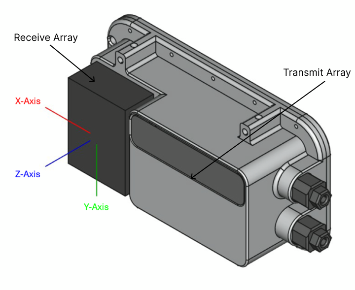

# cerulean_surveyor_mbes

A ROS 2 driver for the [Cerulean Surveyor240](https://ceruleansonar.com/products/surveyor-240) multibeam echo sounder (MBES). It connects to the sonar over UDP or serial, continuously reads incoming packets, and publishes sensor data as standard ROS 2 messages.

## Dependencies

- [`brping`](https://github.com/bluerobotics/ping-python) — Blue Robotics ping protocol library<br>
  
```pip install --user bluerobotics-ping --upgrade```

## Building

```bash
colcon build --packages-select cerulean_surveyor_interfaces cerulean_surveyor_driver 
```

## Running

```bash
ros2 launch cerulean_surveyor_driver surveyor_mbes_driver.launch.py
```

## Published Topics

| Topic | Message Type | Description |
|---|---|---|
| `surveyor/imu` | `sensor_msgs/Imu` | Orientation (roll & pitch) derived from the sonar's onboard attitude report. Expressed as a quaternion. Angular velocity and linear acceleration fields are not populated (`covariance[0] = -1` indicates unknown covariance) |
| `surveyor/euler/pitch` | `cerulean_surveyor_interfaces/Float32Stamped` | Pitch angle in radians. Positive = bow up |
| `surveyor/euler/roll` | `cerulean_surveyor_interfaces/Float32Stamped` | Roll angle in radians. Positive = port down |
| `surveyor/temperature` | `sensor_msgs/Temperature` | Water temperature in °C from the onboard Bar30 sensor |
| `surveyor/pressure` | `sensor_msgs/FluidPressure` | Water pressure in Pa from the onboard Bar30 sensor |
| `surveyor/atof` | `cerulean_surveyor_interfaces/Float32MultiArrayStamped` | Raw ATOF data. 2×N array: row 0 = beam angles (rad), row 1 = time-of-flight (s). Access: `angle[i] = data[i]`, `tof[i] = data[N+i]` |
| `surveyor/pointcloud` | `sensor_msgs/PointCloud2` | Beam returns converted to XYZ in the sensor frame. `x=0`, `y=distance·sin(angle)`, `z=−distance·cos(angle)` |

## Coordinate Frame

## Acknowledgement
This ROS2 package is built as a wrapper on top of the [example script](https://github.com/bluerobotics/ping-python/blob/master/examples/surveyor240Example.py) provided by BlueRobotics. We really appreciate their work.